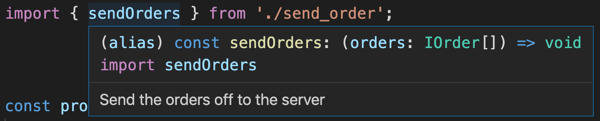
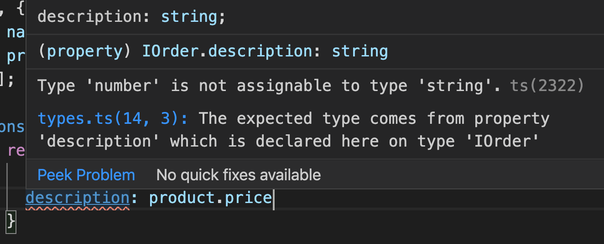

# TypeScript Session 1 - What & Why

## Why should we use it

Better code completion / intellisense

It gives you the ability to interrogate a variable without having to look at it's source
- Parameters
- Return types
- Documentation

--- 

# What benefits does it bring

- Fail fast - IDE will tell me the code isn't going to work before I've even ran it

- You can write code in the same way, but TypeScript will actually compile to javascript and will optimize further if possible

- Because the interfaces (aka types) are tranferable, you can use them in different projects and link their API's together.

- Type definition files allow you to outline a legacy javascript file so you can obtain the above benefits of interrogating exported members

- TS simplifies JS code and makes it simpler and cleaner to debug. You can also generate source maps for the browser to debug in dev tools.

- TS has additional language features such as enums, inheritence, interfaces, also public, private, protected methods

- If you are using babel, you are already using something like typescript because it takes your code and transpiles it to es5/es6/es7/es8.

- It kills the dynamic nature of JavaScript.

---

## Downsides of TypeScript

- It kills the dynamic nature of JavaScript.

- There is a non-zero chance of their being a bug in the TypeScript language which may introduce an error. The chances are slim as the language is so popular

- Recompilation times are longer. For example hot module reloading

- Steeper learning curve than JavaScript. You have to learn JavaScript and then also how to work with a typed language.

- TypeScript definitions are maintained by the open source community. So they could fall out of date. However you can contribute as it is open source :).

<pre>  
  
  
  
  
  
  
  
  
  
  
  
  
  
  
  
  
  
  
  
  
  
  
  
  
  
  
  
  
  
  
  
</pre>

--- 

# Potential Questions (FAQ)
### Will it be around in 5 years?
- Wide community adoption
- Angular, React uses & recommends TS
- Backed my Microsoft
- VSCode is written in TypeScript and is used by 50% of devs in the 2019 stack overflow survey: https://insights.stackoverflow.com/survey/2019#development-environments-and-tools
- It really isn't a huge task to remove it if this becomes true

### Is it true it slows your development speed
- Whenever you learn a new language, it is always slower to write in it. Until you get experienced with it and then you should be at least as fast, if not faster.
- Doesn't hurt to learn it and find out

### I don't think the benefits are enough, why should I bother?
- The benefits become obvious when you really use the language properly
- In the web development process, languages and tools change often. It's good to at least stay in the know by trying it yourself.

### I'm struggling to set TypeScript up. I can't be arsed with messing with config.
- There's help at hand, use a boilerplate project for now. Try create-react-app or equivalent.
- Ask for some help from other members of the team
- It works well alongside webpack and has well documented guides to add it in.

